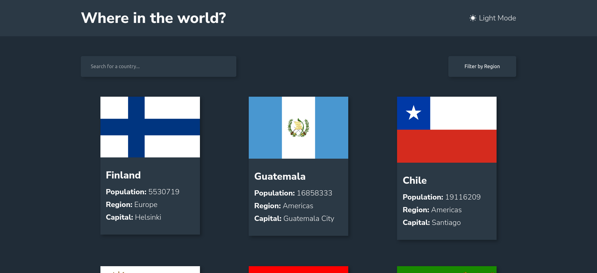
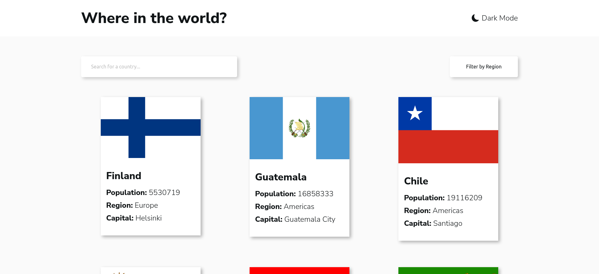
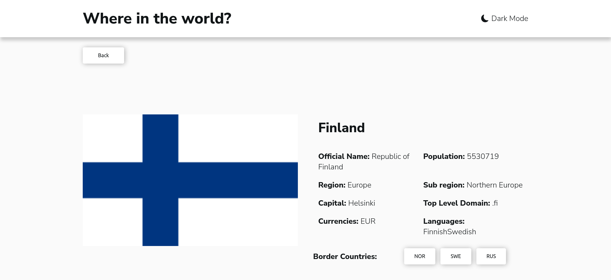
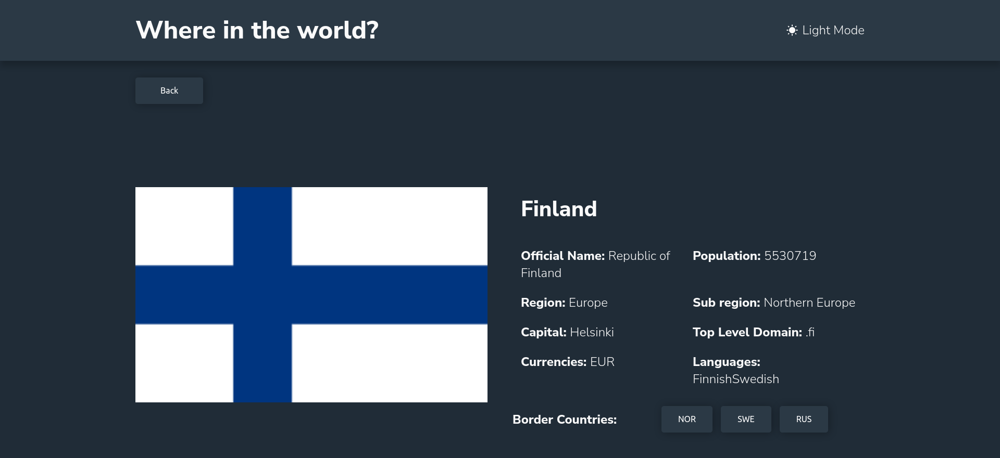
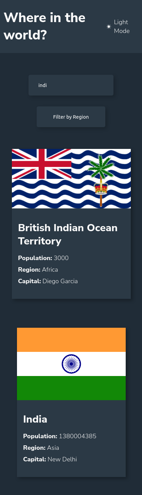
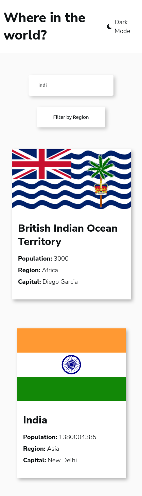
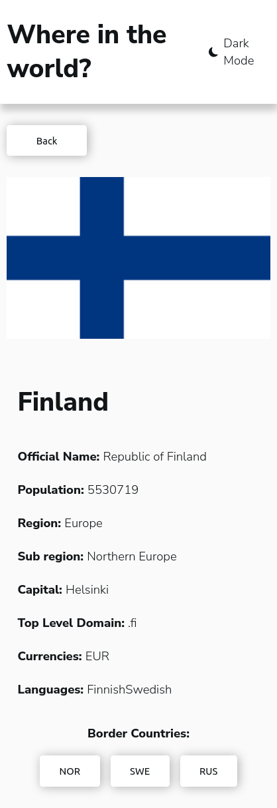
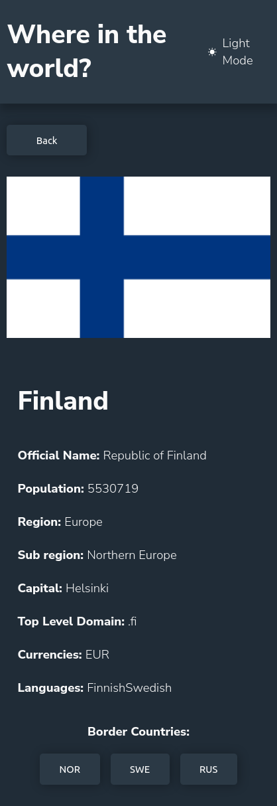

# Frontend Mentor - REST Countries API with color theme switcher solution

This is a solution to the [REST Countries API with color theme switcher challenge on Frontend Mentor](https://www.frontendmentor.io/challenges/rest-countries-api-with-color-theme-switcher-5cacc469fec04111f7b848ca). Frontend Mentor challenges help you improve your coding skills by building realistic projects.

## Table of contents

- [Overview](#overview)
  - [The challenge](#the-challenge)
  - [Screenshot](#screenshot)
  - [Links](#links)
- [My process](#my-process)
  - [Built with](#built-with)

## Overview

### The challenge

Users should be able to:

- See all countries from the API on the homepage
- Search for a country using an `input` field
- Filter countries by region
- Click on a country to see more detailed information on a separate page
- Click through to the border countries on the detail page
- Toggle the color scheme between light and dark mode

### Screenshot

#### Desktop

#### Mobile

### Links

- Live Site URL: [Add live site URL here](https://your-live-site-url.com)

## My process

### Built with

- Semantic HTML5 markup
- CSS pre-processor SASS
- Flexbox
- [React](https://reactjs.org/) - JS library
- React Router DOM
- React Icons

### Layout

The designs were created to the following widths:

- Mobile: 375px
- Desktop: 1440px

### Colors

#### Neutral

- Dark Blue (Dark Mode Elements): hsl(209, 23%, 22%)
- Very Dark Blue (Dark Mode Background): hsl(207, 26%, 17%)
- Very Dark Blue (Light Mode Text): hsl(200, 15%, 8%)
- Dark Gray (Light Mode Input): hsl(0, 0%, 52%)
- Very Light Gray (Light Mode Background): hsl(0, 0%, 98%)
- White (Dark Mode Text & Light Mode Elements): hsl(0, 0%, 100%)

### Typography

#### Body Copy

- Homepage Items: 14px
- Detail Page: 16px

#### Fonts

- Family: [Nunito Sans](https://fonts.google.com/specimen/Nunito+Sans)
- Weights: 300, 600, 800
